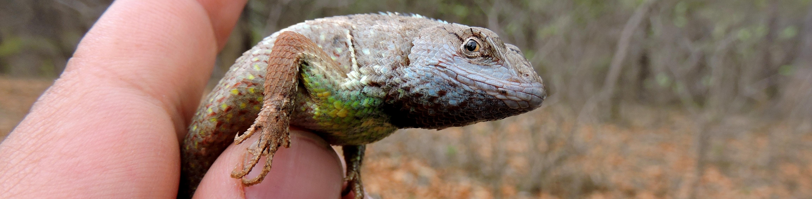

--- 
title: "Similitud de Comunidades biológicas"
author: "Carlos Iván Espinosa"
date: "Enero 2022"
site: bookdown::bookdown_site
output: 
  bookdown::gitbook:
    highlight: haddock
documentclass: book
bibliography: [packages.bib]
biblio-style: apalike
link-citations: yes
github-repo: rstudio/bookdown-demo

---

# Prefacio {-}

-------

La comunidad biológica se refiere a una agrupación de poblaciones de especies que se presentan juntas en el espacio y el tiempo (Begon et al. 1999). Este concepto plantea que las comunidades tienen unos límites espaciales y temporales. Estos límites están dados por la distribución de las poblaciones a lo largo de un gradiente espacial o temporal. De esta forma los cambios en abundancia de las especies a lo largo de gradientes espaciales o temporales generan la zonación y la sucesión respectivamente.

La identificación de formaciones biológicas en el espacio (__zonación__), o las etapas seriales a lo largo del tiempo (__sucesión__), implica qué tenemos la capacidad de establecer en qué momento una comunidad cambia. Parece una tarea sencilla, pero realmente no lo es, ¿cuánto debería cambiar una comunidad para poder hablar de etapas seriales o zonas distintas? y ¿cómo podemos calcular ese cambio? Una de las formas de responder estas preguntas puede ser intentar cuantificar las similitudes entre localidades.

# Objetivos {-}

-------

En este ejercicio mostramos las bases del cálculo de similitud y distancia entre comunidades, el cual se convierte en la base de los análisis multivariantes de la comunidad.

Específicamente nos interesa;

 * Comprender las bases teóricas para el cálculo de similitudes y distancias en la comunidad entre localidades.
 * Desarrollar mediciones de similitud entre localidades e interpretar los resultados.

 
